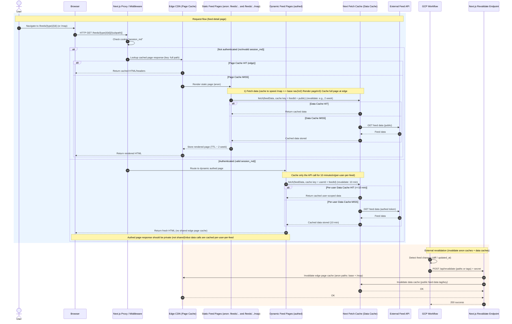

```mermaid
sequenceDiagram
  autonumber
  actor U as User
  participant B as Browser
  participant P as Next.js Proxy / Middleware
  participant EC as Edge CDN (Page Cache)
  participant S as Static Feed Pages (anon: /feeds/... and /feeds/.../map)
  participant D as Dynamic Feed Pages (authed)
  participant FC as Next Fetch Cache (Data Cache)
  participant API as External Feed API
  participant GCP as GCP Workflow
  participant RV as Next.js Revalidate Endpoint

  rect rgb(235,245,255)
    note over U,API: Request flow (feed detail page)

    U->>B: Navigate to /feeds/{type}/{id} (or /map)
    B->>P: HTTP GET /feeds/{type}/{id}[/{subpath}]

    P->>P: Check cookie "session_md"
    alt Not authenticated (no/invalid session_md)
      P->>EC: Lookup cached page response (key: full path)
      alt Page Cache HIT (edge)
        EC-->>B: Return cached HTML/headers
      else Page Cache MISS
        EC->>S: Render static page (anon)
        note over S,FC: 1) Fetch data (cache to speed /map <-> base nav)\n2) Render page\n3) Cache full page at edge
        S->>FC: fetch(feedData, cache key = feedId + public) (revalidate: e.g., 2 week)
        alt Data Cache HIT
          FC-->>S: Return cached data
        else Data Cache MISS
          FC->>API: GET feed data (public)
          API-->>FC: Feed data
          FC-->>S: Cached data stored
        end
        S-->>EC: Store rendered page (TTL ~ 2 week)
        EC-->>B: Return rendered HTML
      end

    else Authenticated (valid session_md)
      P->>D: Route to dynamic authed page
      note over D,FC: Cache only the API call for 10 minutes\n(per-user-per-feed)
      D->>FC: fetch(feedData, cache key = userId + feedId) (revalidate: 10 min)
      alt Per-user Data Cache HIT (<=10 min)
        FC-->>D: Return cached user-scoped data
      else Per-user Data Cache MISS
        FC->>API: GET feed data (authed token)
        API-->>FC: Feed data
        FC-->>D: Cached data stored (10 min)
      end
      D-->>B: Return fresh HTML (no shared edge page cache)
      note over D,B: Authed page response should be private (not shared)\nbut data calls are cached per-user-per-feed
    end
  end

  rect rgb(255,245,235)
    note over GCP,RV: External revalidation (invalidate anon caches + data caches)

    GCP->>GCP: Detect feed changes (diff / updated_at)
    GCP->>RV: POST /api/revalidate (paths or tags) + secret
    RV->>EC: Invalidate edge page cache (anon paths: base + /map)
    RV->>FC: Invalidate data cache (public feed data tag/key)
    FC-->>RV: OK
    EC-->>RV: OK
    RV-->>GCP: 200 success
  end
```